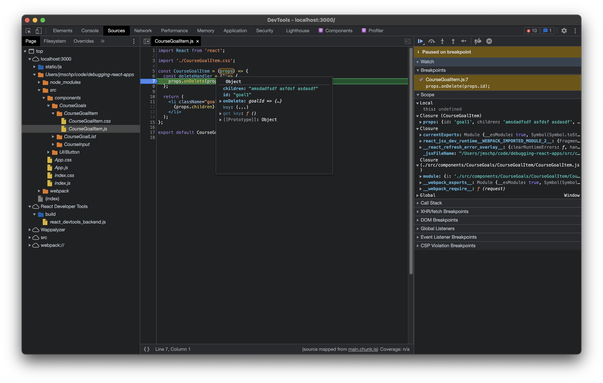

# 86. Working with Breakpoints

On Google Chrome we have a set of tools to help us debug JavaScript code. First we open Chrome DevTools and in the **Sources** tab, we can browse through the source files being used.

Although the browser is not actually running the code we wrote, its running the compiled version built by React, in the **Sources** tab we can see the raw files.

We can than open a file select the line where we want to place the breakpoint. In this case on the `deleteHandler` function of the `CourseGoalItem` component.

When we trigger that function code execution will stop there, and we can inspect variables and other elements, just by hovering the mouse over it.

With the following control buttons, we can control code execution.

1. Resume script execution / Pause script execution.
2. Step over next function call. Will execute the next function without walking through it.
3. Step into next function call. Will go into the the next function, if necessary opening the file where this function is.
4. Step out current function call. Will continue execution of the current function.
5. Step. Go step by step

[Google Debug JavaScript Docs](https://developer.chrome.com/docs/devtools/javascript/)
