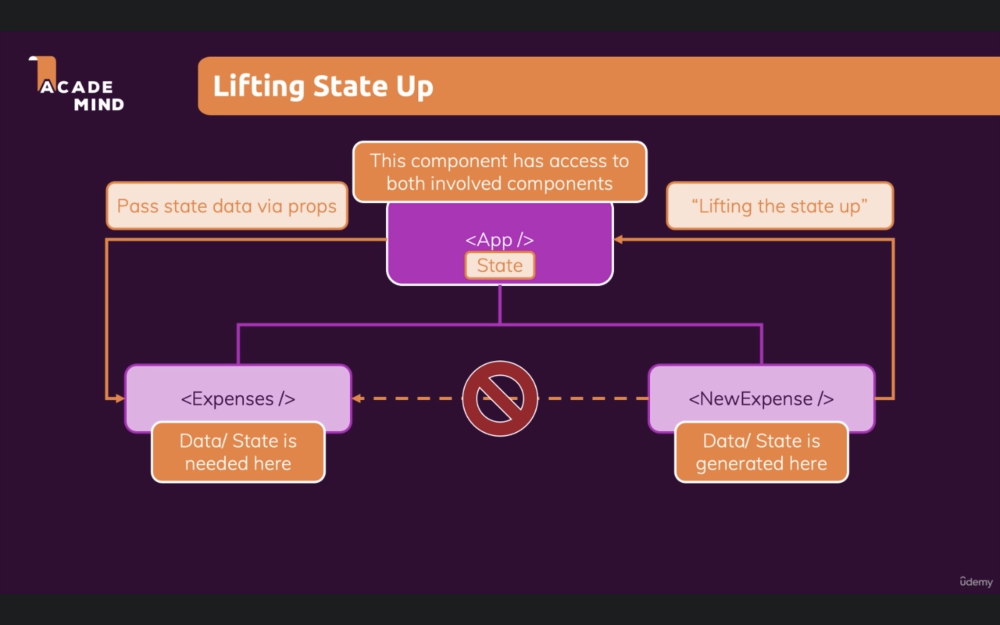

# 59. Lifting The State Up

It very common in React that we generate data, in one component, and then utilize that data in another component. If there is no direct link (parent-child) between this two components, data first as to be passed to a common parent component.

In our case `<NewExpense />` component generates data, and them it passes to the `<App />` component, which then sends that data as `props` to the `<Expenses />` component.

